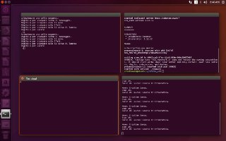

# ROS_Homework_1  my homework ros package
------------------------------------------------------------------------

## University of Verona (Italy)
## A.Y. 2017/2018 
## Laboratorio Ciberfisico 
## Ros Programing 

### Il compito assegnato è: 
------------------------------------------------------------------------

Si realizzi un package ROS contenente degli opportuni nodi per poter svolgere i compiti seguenti:

* Un nodo pubblica, 1 volta al secondo, un messaggio contenente un nome, una età, e un corso di laurea
* Un nodo permette di selezionare da tastiera quale parte del messaggio verrà mostrata a video (si veda la pagina seguente per i dettagli)
* Un nodo mostra a video la parte del messaggio selezionata
Il nodo che permette di selezionare da tastiera quale parte del messaggio mostrare dovrà comportarsi nel modo seguente:

* Digitando ‘a’ verrà stampato tutto il messaggio
* Digitando 'n’ mostrerà solo il nome
* Digitando ‘e’ mostrerà solo l’età
* Digitando ‘c’ mostrerà solo il corso di laurea

### Prima di tutto: 
------------------------------------------------------------------------

#. Clonare la repository nel proprio catkin workspace, per farlo basta posizionarsi nella cartella e utilizzare il seguente comando da terminale:

$ git clone https://github.com/CristianSandu/ROS_Homework_1.git

#. Compilare il pacchetto utilizzando il commando:

$ catkin_make --pkg ROS_Homework_1

#. Dentro alla cartella launch del pacchetto si trova un file bash chiamato launch.sh Dare i permessi con il seguente commando

$ chmod +x ROS_Homework_1/launch/launch.sh

#. Eseguire il launch.sh per avviare i nodi:

$ ROS_Homework_1/launch/launch.sh

### Come funziona  
------------------------------------------------------------------------

Ci sono tre nodi:

* selector
* sender 
* viewer

Il primo pubblica un menu di scelta a video dal quale l'utente sceglie una della opzioni a, n, e, c, x. La selezione viene inviata al nodo viewer attraverso il topic /comando. Il nodo sender invia al nodo viewer il messaggio composto da un nome, un corso di laurea, un'età. Il messaggio è un messaggio custom definito nella cartella msg in un file di nome Num.msg;Il messaggio viene inviato attraverso il topic /dati. Il nodo viewer una volta ricevuti il comando e il messaggio seleziona la parte che interessa all'utente e la pubblica a schermo. Una volta finito l'utente può scegliere la x per uscire e tutti i relativi nodi vengono chiusi.

### Grafo di esecuzione  
------------------------------------------------------------------------

Attraverso il comando:

$ rqt_graph

viene visualizzato il seguente grafo nel quale si vedono i nodi e i topic:

### Screenshot di esecuzione  
------------------------------------------------------------------------

### References 
------------------------------------------------------------------------
[Pagina del corso](http://profs.scienze.univr.it/~bloisi/corsi/ciberfisico.html)

[Ros tutorials](http://wiki.ros.org/ROS/Tutorials)

### Autore  
------------------------------------------------------------------------

[Sandu Alin Cristinel](https://github.com/CristianSandu)
[Università degli Studi di Verona](http://www.univr.it/jsp/index.jsp) 

Please, report suggestions/comments/bugs to 
[Sandu Alin Cristinel](alincristinel.sandu@gmail.com)
